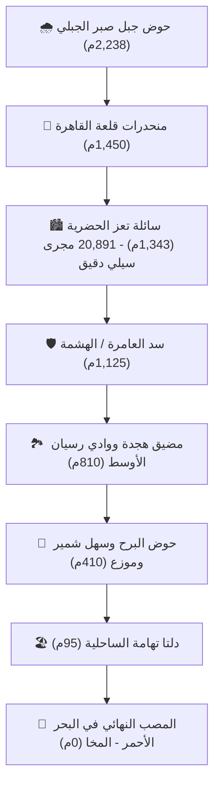

# 🌊 Taiz Urban Hydro-Twin 3D | التوأم الرقمي الهيدرولوجي لمدينة تعز

<div align="center">

[](https://basharameen000.github.io/taiz-urban-hydro-twin/)
[](https://github.com/basharameen000/taiz-urban-hydro-twin/blob/main/Taiz_Urban_Hydro_Twin.qgs)
[](https://opensource.org/licenses/MIT)
[]()

**High-Precision 3D Hydrological Digital Twin, Urban Flood Risk Simulation & Google Maps Native Integration for Taiz City, Yemen.**

[**🌍 استعراض التوأم الرقمي ثلاثي الأبعاد مباشرة (Live 3D App)**](https://basharameen000.github.io/taiz-urban-hydro-twin/)

</div>

---

## 📑 نبذة عن المشروع | Executive Overview

يُعد مشروع **التوأم الرقمي الهيدرولوجي لمدينة تعز (Taiz Urban Hydro-Twin 3D)** نقلة نوعية في نمذجة ومحاكاة مخاطر السيول الجارفة والفيضانات الحضرية في اليمن والمنطقة العربية. يدمج المشروع بين البيانات الهيدروغرافية فائقة الدقة، نماذج الارتفاعات الرقمية (DEM)، وتقنيات الويب الجغرافي ثلاثي الأبعاد (Deck.gl / MapLibre 3D)، مع الربط المباشر بخوادم خرائط جوجل (**Google Maps Hybrid / Streets / Terrain**) لتقديم بيئة بصرية تفاعلية خالية من التشويش وواضحة المعالم مع الحفاظ التام على كامل أسماء الأحياء والشوارع باللغة العربية.

---

## 🚀 القدرات الهيدرولوجية والمكونات الفنية | Technical Architecture



### 1. 🌊 شبكة المجاري المائية الحضرية الدقيقة (Micro-Urban Streams):
* تحليل ونمذجة **20,891 مجرى سيلي دقيق** داخل النسيج العمراني لشوارع وأحياء مدينة تعز.
* حساب مسارات التدفق التراكمي وتحديد نقاط الاختناق في شوارع جمال، 26 سبتمبر، حوض الأشرف، والجحملية.

### 2. 🏘️ مصفوفة المباني والمنشآت تحت الخطر (424 Buildings at Risk):
* تصنيف هيدرولوجي دقيق لـ **424 مبنى ومنشأة حيوية** تقع في مسارات الإغراق والسيول المباشرة.
* تصنيف المخاطر: `عالية جداً (Extreme)`، `مرتفعة (High)`، `متوسطة (Moderate)`.

### 3. 🗺️ ممر التصريف الإقليمي الشامل حتى البحر الأحمر (125.4 km Corridor):
* تتبع المسار الهيدرولوجي الكامل من قمة جبل صبر عبر سد العامرة، وادي رسيان، البرح، موزع وحتى ساحل البحر الأحمر شمال المخا.
* معايرة **1,390 نقطة منسوب طبوغرافي دقيقة** ترسم مقطع الانحدار الطبوغرافي الشامل (Topographic Profile).

### 4. 🧭 التكامل الأصلي مع خرائط جوجل (Native Google Maps Integration):
* إدراج طبقات جوجل المباشرة باللغة العربية الفصحى دون أي تشويش:
  1. **Google Hybrid:** صور فضائية واقعية مع أسماء الشوارع والأحياء والمعالم بدقة متناهية.
  2. **Google Roadmap / Streets:** خريطة الشوارع الحضرية الواضحة.
  3. **Google Terrain:** خريطة التضاريس والخطوط الكنتورية ومناسيب الجبال.
  4. **CartoDB Dark Matter:** النمط السيبراني المظلم للتحليل الهيدرولوجي الليلي.
  5. **OpenStreetMap Standard:** الخريطة الطبوغرافية المفتوحة.

---

## 📂 هيكل ملفات المستودع | Repository Structure

```text
taiz-urban-hydro-twin/
│
├── index.html                               # التطبيق التفاعلي المباشر ثلاثي الأبعاد (GitHub Pages)
├── Taiz_Urban_Hydro_Twin_3D.html            # الملف المصدري الكامل للتوأم الرقمي
├── Taiz_Urban_Hydro_Twin.qgs                # مشروع نظم المعلومات الجغرافية المكتبي QGIS Project
│
├── data/                                    # مستودع البيانات الجغرافية المكانية المفتوحة (GeoJSON)
│   ├── taiz_micro_urban_streams.geojson     # شبكة المجاري الدقيقة (20,891 مجرى)
│   ├── taiz_buildings_at_risk.geojson       # المباني المعرضة للخطر (424 مبنى)
│   ├── taiz_to_redsea_full_corridor.geojson # ممر التصريف للبحر الأحمر (125.4 كم)
│   ├── taiz_flood_milestones.geojson        # محطات التدفق والسدود الرئيسية
│   ├── taiz_watershed.geojson               # حدود الأحواض الهيدروغرافية
│   └── taiz_urban_landmarks.geojson         # المعالم الحضرية والتاريخية
│
├── docs/                                    # التقارير والدراسات الفنية التفصيلية
│   └── Taiz_Hydrological_Analysis_Report.md # تقرير التحليل الهيدرولوجي الميداني
│
└── images/                                  # المخططات والخرائط التوضيحية
    ├── Taiz_Urban_Hydro_Twin_Map.png
    └── QGIS_Taiz_Hydro_Twin_Desktop_View.png
```

---

## 💻 تعليمات التشغيل والاستخدام | Usage & Deployment

### 1. الاستعراض عبر المتصفح (Web 3D):
* افتح الرابط المباشر: [https://basharameen000.github.io/taiz-urban-hydro-twin/](https://basharameen000.github.io/taiz-urban-hydro-twin/)
* أو قم بتحميل المستودع وافتح `index.html` في أي متصفح يدعم WebGL.

### 2. الفتح والتحليل عبر برنامج QGIS Desktop:
* قم بفتح ملف `Taiz_Urban_Hydro_Twin.qgs` داخل تطبيق **QGIS** (الإصدار 3.22 وما بعده).
* ستظهر كافة الطبقات الهيدرولوجية بالترميز اللوني المعياري ومصنفة حسب مستويات الخطورة.

---

## 📊 البيانات والمصادر | Datasets & Standards

* **DEM Resolution:** Copernicus GLO-30 & SRTM 30m Hydro-Corrected DEM.
* **Urban Features:** OpenStreetMap (OSM) & High-Resolution Satellite Digitization.
* **Hydrological Engine:** D8 / Tarboton Flow Accumulation & Stream Ordering.
* **Coordinate System:** WGS 84 / Pseudo-Mercator (EPSG:4326 / EPSG:3857).

---

## 📜 الترخيص والحقوق | License & Attribution

هذا المشروع متاح كمصدر مفتوح تحت رخصة **MIT License**.  
إعداد وتطوير: المهندس / بشار أمين (**@basharameen000**).
