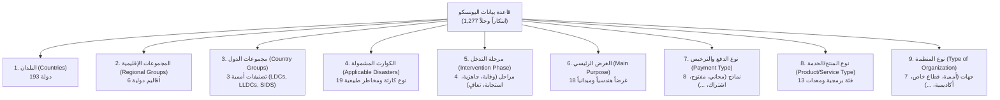

# 🌐 المستودع الشامل لقاعدة بيانات مركز اليونسكو للابتكار الرقمي (1,277 ابتكاراً)
## UNESCO Digital Innovation Hub — Grid Database & 9-Facet Architecture (2026)
**الرابط الرسمي المباشر:** [https://www.unesco.org/en/unesco-digital-innovation-hub/grid](https://www.unesco.org/en/unesco-digital-innovation-hub/grid)  
**إجمالي الابتكارات والحلول المسجلة:** **1,277 ابتكاراً وحلاً تقنياً دولياً**

---

### 🏛️ الفلاتر التسعة الرسمية ومعاملات الاستعلام الدقيقة (The 9 Exact Solr Facets)

تم استخراج البنية الهيكلية الكاملة لمنظومة الفلترة والاستعلام البرمجي المستخدمة في واجهة Apache Solr / Search API لقاعدة البيانات:



---

### 🔍 تفصيل محددات الفلترة التسعة وخياراتها البرمجية:

#### 1. بلدان (Countries) — `193 دولة`
* **معامل الاستعلام (Query Param):** `fq[sm_unsc_field_ref_countries_label][]`
* **النطاق:** كافة الدول الأعضاء في اليونسكو (تشمل اليمن، السعودية، مصر، اليابان، الولايات المتحدة، ألمانيا، وغيرها).

#### 2. المجموعات الإقليمية (Regional Groups) — `6 أقاليم`
* **معامل الاستعلام:** `fq[sm_unsc_field_ref_regions_label][]`
* **الخيارات:**
  1. `Arab States` (الدول العربية)
  2. `Africa` (إفريقيا)
  3. `Asia and the Pacific` (آسيا والمحيط الهادئ)
  4. `Europe and North America` (أوروبا وأمريكا الشمالية)
  5. `Latin America and the Caribbean` (أمريكا اللاتينية والبحر الكاريبي)
  6. `Global` (حلول وتطبيقات ذات نطاق عالمي)

#### 3. مجموعات الدول (Country Groups) — `3 فئات خاصة`
* **معامل الاستعلام:** `fq[sm_unesco_country_groups][]`
* **الخيارات:**
  1. `ldc` — **Least Developed Countries (LDCs)** (البلدان الأقل نمواً — تشمل اليمن)
  2. `lldc` — **Landlocked Developing Countries (LLDCs)** (البلدان النامية غير الساحلية)
  3. `sids` — **Small Island Developing States (SIDS)** (الدول الجزرية الصغيرة النامية)

#### 4. الكوارث المشمولة (Applicable Disasters) — `19 نوع خطر`
* **معامل الاستعلام:** `fq[sm_unsc_hierarchical_field_ref_datasets_filters_label][Applicable Disasters][]`
* **الخيارات:**
  * `Flood` (السيول والفيضانات)
  * `Drought` (الجفاف)
  * `Earthquake` (الزلازل)
  * `Landslide` (الانهيارات والانزلاقات الأرضية)
  * `Tsunami` (أمواج التسونامي)
  * `Storm` (العواصف والأعاصير المدارية)
  * `Extreme temperature` (موجات الحر والبرودة الشديدة)
  * `Wildfire` (حرائق الغابات)
  * `Epidemic` (الأوبئة وتفشي الأمراض)
  * `Coastal erosion` (تآكل السواحل)
  * `Glacial lake outburst` (فيضانات البحيرات الجليدية)
  * `Sand and dust storm` (العواصف الرملية والغبارية)
  * `Volcanic activity` (النشاط البركاني)
  * `Fog` (الضباب الكثيف)
  * `Insect infestation` (الآفات الحشرية والجراد)
  * `Animal accident`, `Complex emergency`, `Industrial accident`, `Others`.

#### 5. مرحلة التدخل (Intervention Phase) — `4 مراحل دورة الكارثة`
* **معامل الاستعلام:** `fq[sm_unsc_hierarchical_field_ref_datasets_filters_label][Intervention Phase][]`
* **الخيارات:**
  1. `Prevention and mitigation` (الوقاية والحد من المخاطر)
  2. `Preparedness` (الجاهزية والاستعداد المبكر)
  3. `Response` (الاستجابة والتدخل السريع)
  4. `Recovery and Reconstruction` (التعافي وإعادة الإعمار بعد الكارثة)

#### 6. الغرض الرئيسي (Main Purpose) — `18 غرضاً تطبيقياً`
* **معامل الاستعلام:** `fq[sm_unsc_hierarchical_field_ref_datasets_filters_label][Main purpose][]`
* **الخيارات الرئيسية:**
  * `Early warning and prediction` (الإنذار المبكر والتنبؤ الرياضي)
  * `Disaster monitoring` (رصد ومراقبة الكوارث عبر الأقمار الصناعية)
  * `Hazard mapping` & `Risk assessment and mapping` (رسم خرائط المخاطر والتقييم الهيدرولوجي)
  * `Capacity building` (بناء القدرات وتدريب الكوادر)
  * `Community engagement and education` (التوعية المجتمعية والمشاركة الشعبية)
  * `Data and knowledge management` (إدارة قواعد البيانات والمعرفة الجغرافية)
  * `Resilient infrastructure` (البنية التحتية المقاومة للسيول والزلازل)
  * `Emergency logistics and supply chain` (اللوجستيات وإدارة سلاسل الإمداد في الطوارئ)
  * `Ecosystem restoration` (استعادة النظم البيئية والأحواض المائية الطبيعية)
  * `Financial instruments and investments` (التأمين والتمويل ضد الكوارث)
  * `Simulation and modeling` (المحاكاة الهيدروليكية ونماذج التوائم الرقمية)
  * `Water and sanitation management` (إدارة المياه والصرف الصحي أثناء الأزمات)

#### 7. نوع الدفع والترخيص (Payment Type) — `8 نماذج`
* **معامل الاستعلام:** `fq[sm_unsc_hierarchical_field_ref_datasets_filters_label][Payment Type][]`
* **الخيارات:**
  1. `Free` (مجاني بالكامل بدون أي رسوم)
  2. `Freemium` (مستوى أساسي مجاني مع ميزات متقدمة مدفوعة)
  3. `License fee` (رسوم ترخيص برمجيات)
  4. `One-time purchase` (شراء لمرة واحدة)
  5. `Subscription` (اشتراك سنوي أو شهري)
  6. `Pay-per-use` (دفع حسب الاستهلاك والبيانات)
  7. `Leasing` (تأجير أجهزة ومستشعرات)
  8. `Others`

#### 8. نوع المنتج / الخدمة (Product/Service Type) — `13 فئة تقنية`
* **معامل الاستعلام:** `fq[sm_unsc_hierarchical_field_ref_datasets_filters_label][Product/Service Type][]`
* **الخيارات:**
  * `Early Warning Systems` (أنظمة الإنذار المبكر الشاملة)
  * `Decision Support Systems` (أنظمة دعم اتخاذ القرار)
  * `Database and Information Management` (إدارة قواعد البيانات السحابية)
  * `Communication Tools` (أدوات البث والاتصال بالأقمار الصناعية)
  * `Mobile Applications` (تطبيقات الهواتف الميدانية)
  * `Mapping & GIS Software` (منصات الخرائط ونظم المعلومات الجغرافية)
  * `Emergency Equipment & Devices` (أجهزة ومعدات الطوارئ)
  * `Infrastructure` (حلول البنية التحتية الصلبة والخضراء)
  * `Consultancy` (الخدمات الاستشارية والتقييمات الفنية)
  * `Training & Education` (منصات التدريب والمحاكاة)

#### 9. نوع المنظمة (Type of Organization) — `7 فئات مؤسسية`
* **معامل الاستعلام:** `fq[sm_unsc_hierarchical_field_ref_datasets_filters_label][Type of Organization][]`
* **الخيارات:**
  1. `International organisation` (منظمات دولية ووكالات أممية)
  2. `Private company` (شركات التكنولوجيا والقطاع الخاص)
  3. `Research institution` (مراكز الأبحاث والجامعات العالمية)
  4. `NGO` (منظمات غير حكومية)
  5. `NPO` (مؤسسات غير ربحية)
  6. `Public sector` (وزارات وهيئات حكومية)
  7. `Others`

---

### 💻 صيغة الاستعلام البرمجي المباشر عبر الرابط (Direct URL Filter Construction):

يمكن استدعاء أي فلترة محددة بدقة عبر بناء الـ URL مباشرة. مثال للبحث عن **حلول السيول المجانية للبلدان الأقل نمواً (LDCs) في الدول العربية**:

```
https://www.unesco.org/en/unesco-digital-innovation-hub/grid?fq%5Bsm_unsc_field_ref_regions_label%5D%5B%5D=Arab%20States&fq%5Bsm_unesco_country_groups%5D%5B%5D=ldc&fq%5Bsm_unsc_hierarchical_field_ref_datasets_filters_label%5D%5BApplicable%20Disasters%5D%5B%5D=Applicable%20Disasters%20%7C-%3E%20Flood&fq%5Bsm_unsc_hierarchical_field_ref_datasets_filters_label%5D%5BPayment%20Type%5D%5B%5D=Payment%20Type%20%7C-%3E%20Free
```
